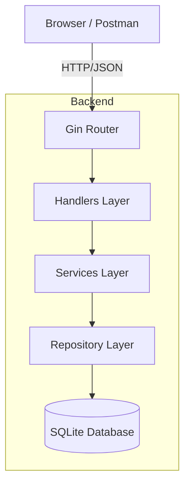

# Eventify — Event Registration and Ticketing System

Table of Contents
- [Architecture Overview](#architecture-overview)
- [Tech Stack](#tech-stack)
- [Database Schema and Concurrency](#database-schema-and-concurrency)
- [REST API Documentation](#rest-api-documentation)
- [Setup and Running Instructions](#setup-and-running-instructions)
- [Project Structure](#project-structure)
- [Author](#author)

## Architecture Overview
The application uses a clean, layered architecture with a clear separation of concerns. This ensures the backend remains modular, maintainable, and easy to test.



### Layer Responsibilities
| Layer | Package | Responsibility |
|-------|---------|----------------|
| **Handlers** | `internal/handlers/` | Translates incoming HTTP requests, validates inputs, and formats JSON responses. |
| **Services** | `internal/services/` | Contains core business logic, including the three-layer concurrency protection logic. |
| **Repository** | `internal/repositories/` | Manages all database operations using GORM. |
| **Models** | `internal/models/` | Defines the data structures and Database/JSON mappings. |
| **Database** | `internal/database/` | Handles the database connection and automatic migrations. |

## Tech Stack
### Backend
- **Go 1.25**: A fast, strongly typed language for efficient backend processing.
- **Gin**: A minimal and fast HTTP web framework for routing.
- **GORM**: A developer-friendly ORM for managing database interactions in Go.
- **SQLite**: A reliable, zero-configuration embedded database for local storage.
- **JWT**: Secure token-based authentication for protected routes.
- **Bcrypt**: Standard password hashing to ensure user security.

### Frontend
- **Vanilla JavaScript**: Pure, fast logic for interactive elements without external framework overhead.
- **CSS3**: Modern styling with glassmorphism and smooth interface transitions.
- **HTML5**: Semantic structure for a professional Multi-Page Application (MPA).

## Database Schema and Concurrency
### Schema Details
The system manages three primary tables, which are automatically migrated by GORM:

#### users Table
```sql
CREATE TABLE users (
    id         VARCHAR(36) PRIMARY KEY,
    name       TEXT NOT NULL,
    email      TEXT NOT NULL UNIQUE,
    password   TEXT NOT NULL,
    role       TEXT DEFAULT 'attendee'
);
```

#### events Table
```sql
CREATE TABLE events (
    id          VARCHAR(36) PRIMARY KEY,
    title       TEXT NOT NULL,
    description TEXT,
    capacity    INTEGER NOT NULL,
    registered  INTEGER DEFAULT 0,
    organizer_id VARCHAR(36) REFERENCES users(id)
);
```

#### registrations Table
```sql
CREATE TABLE registrations (
    id         VARCHAR(36) PRIMARY KEY,
    user_id    VARCHAR(36) REFERENCES users(id),
    event_id   VARCHAR(36) REFERENCES events(id),
    status     TEXT DEFAULT 'confirmed',
    UNIQUE(user_id, event_id, status) -- Prevents duplicate bookings
);
```

### Three-Layer Concurrency Defense
To prevent overbooking when multiple users attempt to register at the same time, the system uses a three-layer protection strategy:
1. **Application Mutex**: Serializes booking requests for the same event at the service level.
2. **Database Transaction**: Ensures the entire registration process succeeds or fails as a single atomic unit.
3. **Conditional UPDATE**: A final check at the database level (`registered < capacity`) ensures it is impossible to book a seat if the event is already full.

## REST API Documentation
Base URL: `http://localhost:8080/api`

### Auth Endpoints
#### POST /auth/register — Create Account
**Request Body:**
```json
{
    "name": "Jane Doe",
    "email": "jane@example.com",
    "password": "securepassword",
    "role": "organizer"
}
```

#### POST /auth/login — Sign In
Returns a JWT token required for protected routes.

---

### Event Endpoints
#### GET /api/events — List All Events
Returns a list of all upcoming events along with their current registration status.

#### POST /api/events — Create Event (Organizer Only)
**Request Body:**
```json
{
    "title": "Tech Summit 2026",
    "description": "A deep dive into Go concurrency.",
    "capacity": 100
}
```

---

### Booking Endpoints
#### POST /api/events/:id/register — Book a Seat
Requires a valid JWT token. This endpoint prevents both overbooking and duplicate registrations.

#### GET /api/me/registrations — My Tickets
Returns all events that the current user has registered for.

## Setup and Running Instructions
### Prerequisites
- Go installed on your system.
- VS Code (Recommended for the best development experience).

### Steps to Run
1. **Clone the repository**:
   ```bash
   git clone https://github.com/Amrutavarshini24/Eventregistration.git
   cd Eventregistration
   ```

2. **Start the Backend**:
   Navigate to the `backend/` directory and run:
   ```bash
   go mod tidy
   go run main.go
   ```

3. **Open the Frontend**:
   Simply open `frontend/index.html` in your web browser or use the VS Code Live Server extension.


## Backend API Verification
You can use these `curl` commands in your terminal to verify that the backend is running correctly:

**1. Health Check**
```bash
curl http://localhost:8080/health
```

**2. List All Events**
```bash
curl http://localhost:8080/api/events
```

**3. Test Registration**
```bash
curl -X POST http://localhost:8080/api/auth/register \
     -H "Content-Type: application/json" \
     -d '{"name":"Test User","email":"test@example.com","password":"password123"}'
```

## Project Structure
```text
Eventregistration/
├── backend/
│   ├── cmd/server/       # HTTP server setup
│   ├── internal/
│   │   ├── handlers/     # API request logic
│   │   ├── services/     # Core business logic
│   │   ├── repositories/ # Database interactions
│   │   └── models/       # Data structures
│   └── main.go           # Application entry
├── frontend/             # HTML, CSS, and JavaScript files
└── postman_collection.json # API test endpoints for Postman
```

## Author
Amrutavarshini Beernalli
Go Capstone Project

